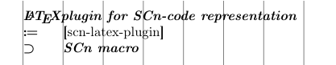

## SCn-LaTeX plugin

This repository contains LaTeX plugin to represent knowledge in [SCn code](https://github.com/ostis-ai/ostis-project).

### Installation

There are three possible ways to use this plugin:

* Global installation

```sh
mkdir -p ~/texmf/tex/latex
git clone https://github.com/ostis-ai/scn-latex-plugin ~/texmf/tex/latex
texhash
```

* Local installation for specific project (e.g. as git submodule)

```sh
# clone current repo where you'd like
git clone https://github.com/ostis-ai/scn-latex-plugin ./scn
# to compile main.tex you may use
TEXINPUTS=./scn: latexmk -pdf -bibtex ./main.tex
```

* You can also use it with Docker.

```sh
docker run -v </abspath/to/project/folder>:/workdir ostis/scn-latex-plugin:latest </path/to/main/tex/file>
```
**Note:** the last argument in command is path in docker container (relative to /workdir)

### Example

```tex
\documentclass{scndocument}

\usepackage{scn}

\begin{document}
\begin{SCn}
\ActivateBG
  \scnheader{\LaTeX plugin for SCn-code representation}
  \scnidtf{scn-latex-plugin}
  \scnsuperset{\scnkeyword{SCn macro}}
\end{SCn}
\end{document}
```

The code above will result in a following .pdf:


